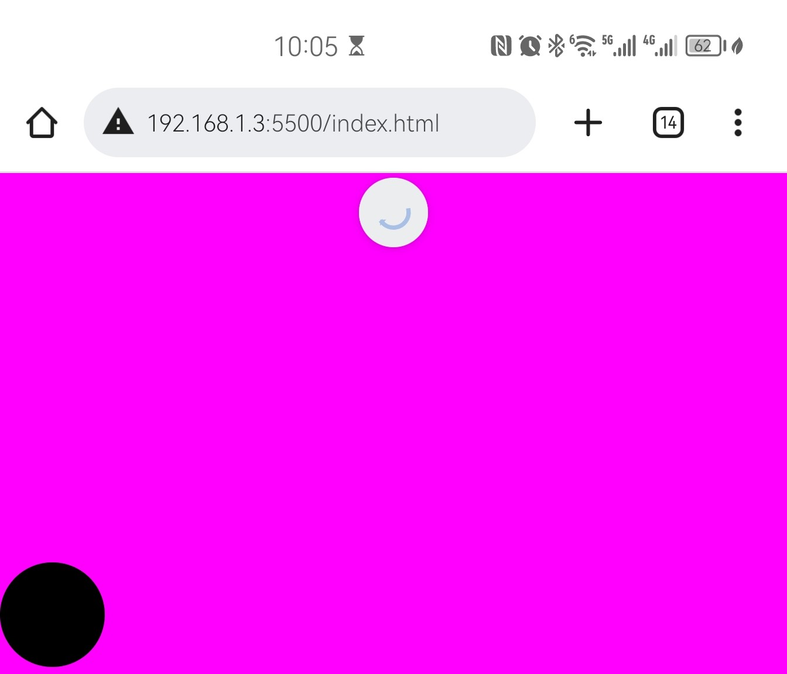
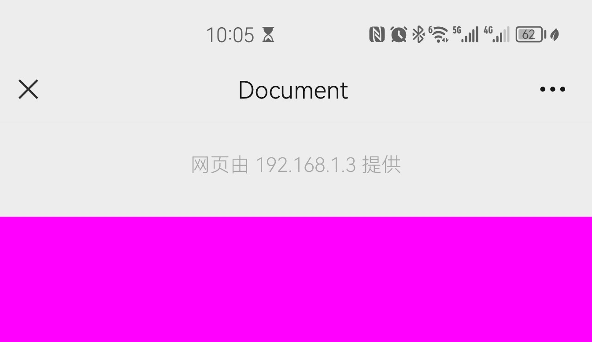

# Touchmove event
 > 会导致向下滑动的时候触发下拉刷新或者显示出微信浏览器背景地址
1. 谷歌浏览器内效果
 
2. 微信内置浏览器效果
 
3. 解决方案
~~~ javascript
<!DOCTYPE html>
<html lang="en">

<head>
    <meta charset="UTF-8">
    <meta http-equiv="X-UA-Compatible" content="IE=edge">
    <meta name="viewport" content="width=device-width, initial-scale=1.0">
    <title>Document</title>
    
</head>

<body>
    

        

    

    
</body>

</html>
~~~

# IOS和Android兼容性
1. IOS 输入框大小需要 16px 要不然让输入的时候，会放大页面，或者页面在html添加 mate 字段，使其禁止缩放
2. Ios 点击按钮，弹出输入框并且需要拉起软键盘的时候，可以吧 按钮换成 label 标签，label 的for 属性就是 input 的 id
3. ios 输入的时候，会把页面出现把页面网上顶，并且无法复原的情况，解决办法
   
   ~~~javascript
    getFocus () {
        $("input,textarea").on("blur", function () {
        window.scroll(0, 0);
        });
    }
   ~~~
